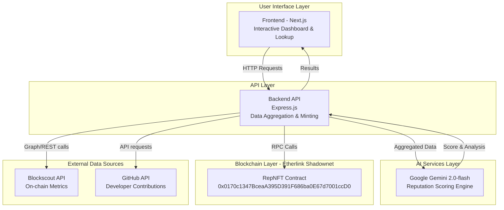
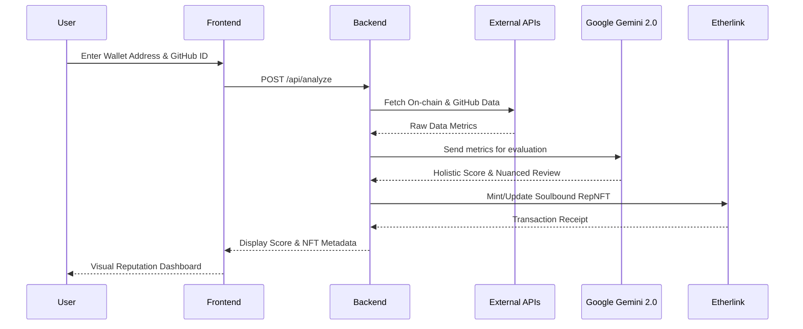

# PROVN — AI Driven Reputation System

**PROVN** is an end-to-end AI-driven reputation scoring system for the Web3 era. It analyzes on-chain activity on Etherlink and GitHub contributions to generate a living, soulbound reputation NFT (RepNFT) for developers and users.

In the decentralized world, a resume is just a list of claims. PROVN turns those claims into **Proof**. By multi-threading data collection from on-chain transactions, GitHub commits, and DeFi interactions, our AI oracle generates a holistic reputation score that lives on the blockchain.

## Resources
* **Demo Video** : [View Here](https://github.com/Temitope15/PROVN)
* **Live Demo** : [https://provn-two.vercel.app](https://provn-two.vercel.app)

---

## Platform Architecture

### High-Level Architecture Diagram


### Data Flow Diagram


---

## System Components

### Frontend
**Technology Stack:**
- Next.js 14
- TypeScript
- Tailwind CSS
- ethers.js v6

**Key Features:**
- **Dynamic Lookup Portal:** Look up any wallet address to view its reputation score.
- **Real-time Leaderboard:** Ranks top contributors by on-chain and off-chain activities.
- **Social Sharing & Export:** One-click sharing to X (Twitter) and LinkedIn; exportable GitHub badges.

### Backend API
**Technology Stack:**
- Node.js & Express.js
- Google Gemini SDK
- Etherlink Blockscout Integration

**Key Responsibilities:**
- **Data Aggregation:** Collects raw data from Etherlink and GitHub.
- **AI Orchestration:** Formats user profiles and requests sophisticated analysis from Gemini.
- **On-chain Oracle:** Writes score updates directly to the RepNFT metadata via RPC calls.

---

## Core Capabilities

### 1. AI-Powered Nuanced Scoring
PROVN utilizes the **Google Gemini 2.0-flash** model as its core reasoning engine. Instead of simple linear scoring, Gemini evaluates the *quality* of activity. A contract deployer earns more "Builder" points, while a high-volume swapper earns "DeFi Enthusiast" marks.

### 2. Live On-chain Reputation
PROVN mints a Soulbound Token (SBT) onto the Etherlink Shadownet. This RepNFT dynamically updates as the user's score changes, serving as immutable proof of credibility.

### 3. Developer & Ecosystem Analytics
Combines raw transaction counts, deployed smart contracts, DeFi engagements, and GitHub repository metrics (commits, top languages, repos) into one holistic dashboard.

---

## Smart Contract Implementations

### RepNFT (Soulbound Token)
The `RepNFT` contract acts as the on-chain ledger for reputation.

- **Non-Transferable**: Ensures reputation cannot be bought or sold.
- **Updatable Metadata**: The backend oracle can call `updateScore` to reflect real-time changes in a user's off-chain and on-chain activity.
- **On-chain Address**: `0x0170c1347BceaA395D391F686ba0E67d7001ccD0`

---

## Setup & Installation

### Prerequisites
- Node.js 18+
- MetaMask or any Web3 wallet
- Gemini API Key
- GitHub Personal Access Token

### Installation

1. **Clone the repo** & **Install dependencies**:
   ```bash
   # Root
   npm install
   
   # Backend
   cd backend && npm install
   
   # Frontend
   cd ../frontend && npm install
   ```

2. **Configure Environment**:
   Create a `.env` file in the `backend/` directory:
   ```env
   GEMINI_API_KEY=your_key_here
   GITHUB_TOKEN=your_pat_here
   PRIVATE_KEY=your_deployer_private_key
   RPC_URL=https://node.shadownet.etherlink.com
   CONTRACT_ADDRESS=0x0170c1347BceaA395D391F686ba0E67d7001ccD0
   FRONTEND_URL=http://localhost:3000
   ```

3. **Run the Project**:
   ```bash
   # Start Backend (Port 3001)
   cd backend && npm start
   # Start Frontend
   cd frontend && npm run dev
   ```

---

## Team
- **Temitope15**: Software Engineer

## Technical Compliance
- **Blockchain**: Deployed on **Etherlink Shadownet** (Testnet).
- **Network RPC**: `https://node.shadownet.etherlink.com`
- **Explorer API**: Blockscout integration for address indexing.

## License
This project is licensed under the MIT License.
